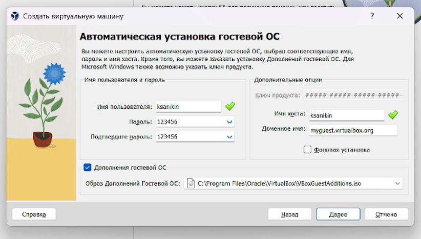
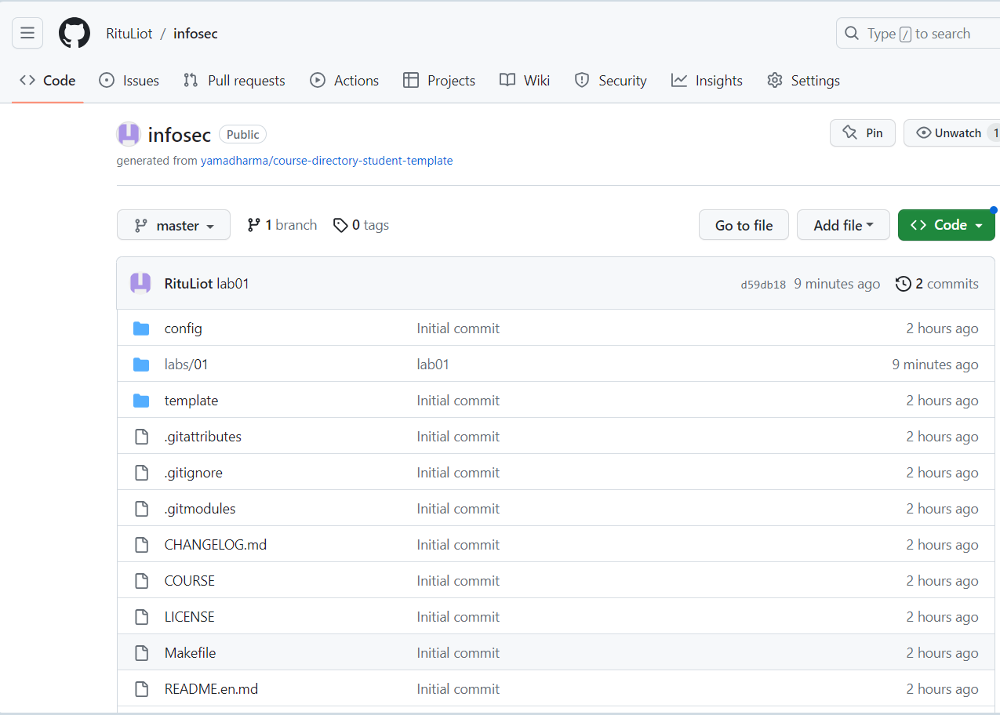
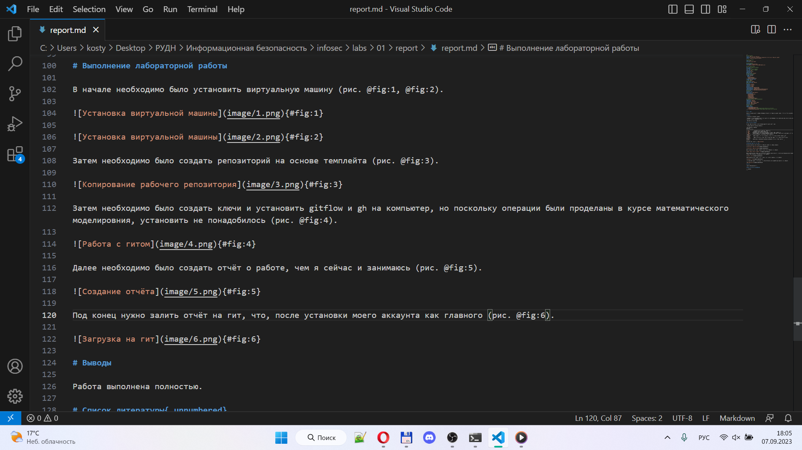
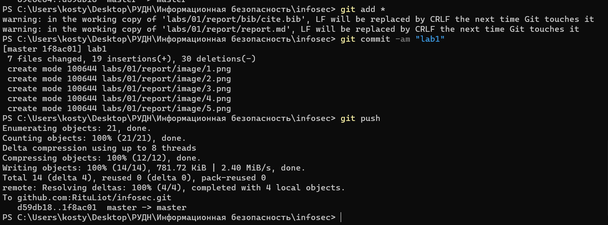

---
## Front matter
lang: ru-RU
title: Лабораторная работа №1
subtitle: Установка и конфигурация операционной системы на виртуальную машину
author:
  - Аникин Константин Сергеевич
institute:
  - Российский университет дружбы народов, Москва, Россия
date: 7 сентября 2023

## i18n babel
babel-lang: russian
babel-otherlangs: english

## Formatting pdf
toc: false
toc-title: Содержание
slide_level: 2
aspectratio: 169
section-titles: true
theme: metropolis
header-includes:
 - \metroset{progressbar=frametitle,sectionpage=progressbar,numbering=fraction}
 - '\makeatletter'
 - '\beamer@ignorenonframefalse'
 - '\makeatother'
---

# Информация

## Докладчик

:::::::::::::: {.columns align=center}
::: 

  * Аникин Константин Сергеевич
  * студент
  * просто студент
  * Российский университет дружбы народов
  * [1032201736@rudn.ru](mailto:1032201736@rudn.ru)
  * <https://rituliot.github.io/ru/>

# Вводная часть

## Цель работы

- Вспомнить правила работы с GitHub и Markdown
- Установить виртуальную машину
- Сделать отчёт об отчёте
- Загрузить отчёт на гит

## Задание

- Сделать отчёт по текущей лабораторной работе в формате Markdown в 3 форматах: pdf, docx и md.

# Выполнение работы

## Установка софта

В начале необходимо было установить виртуальную машину (рис. \ref{fig1}).

## Копирование репозитория

Затем необходимо было скопировать репозиторий лектора на свой профиль в гите и на свой компьютер (рис. \ref{fig3}).

## Создание отчёта

Далее необходимо было создать отчёт о работе, чем я сейчас и занимаюсь (рис. \ref{fig5}).

## Загрузка отчёта

Под конец нужно залить отчёт на гит (рис. \ref{fig6}).

# Вывод

Работа выполнена полностью