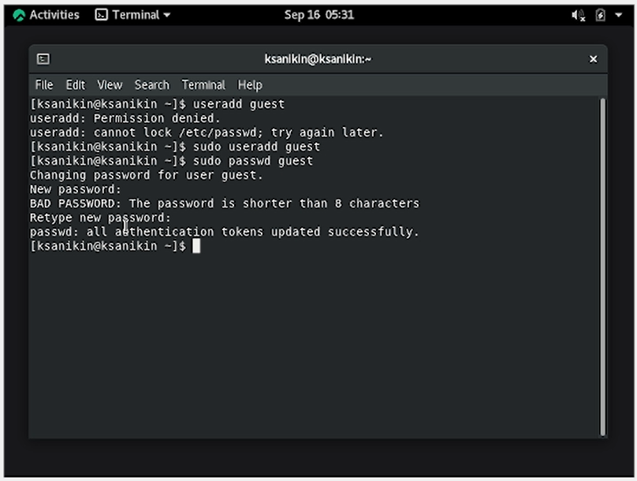
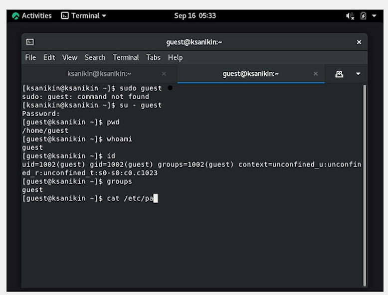
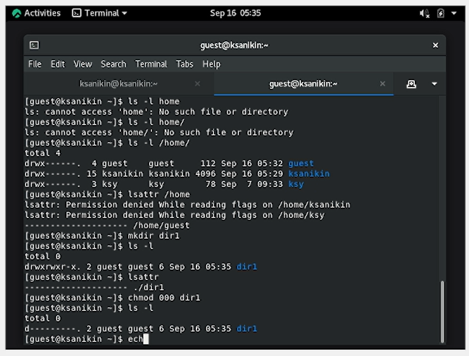

---
## Front matter
lang: ru-RU
title: Лабораторная работа №2
subtitle: Дискреционное разграничение прав в Linux. Основные атрибуты
author:
  - Аникин Константин Сергеевич
institute:
  - Российский университет дружбы народов, Москва, Россия
date: 7 сентября 2023

## i18n babel
babel-lang: russian
babel-otherlangs: english

## Formatting pdf
toc: false
toc-title: Содержание
slide_level: 2
aspectratio: 169
section-titles: true
theme: metropolis
header-includes:
 - \metroset{progressbar=frametitle,sectionpage=progressbar,numbering=fraction}
 - '\makeatletter'
 - '\beamer@ignorenonframefalse'
 - '\makeatother'
---

# Информация

## Докладчик

:::::::::::::: {.columns align=center}
::: 

  * Аникин Константин Сергеевич
  * студент
  * просто студент
  * Российский университет дружбы народов
  * [1032201736@rudn.ru](mailto:1032201736@rudn.ru)
  * <https://rituliot.github.io/ru/>

# Вводная часть

## Цель работы

Получение практических навыков работы в консоли с атрибутами файлов, закрепление теоретических основ дискреционного разграничения доступа в современных системах с открытым кодом на базе ОС Linux.

## Задание

- Создать нового пользователя 

- Заполнить таблицы прав доступа

# Выполнение работы

## Создание пользователя

В начале необходимо было создать нового пользователя (рис. \ref{fig1}).

## Получение информации

И получить информацию всякого рода из него (рис. \ref{fig2}).

## Получение информации

Далее необходимо было разобраться с правами доступа в новосозданной папке (рис. \ref{fig3}).

# Вывод

Работа выполнена полностью