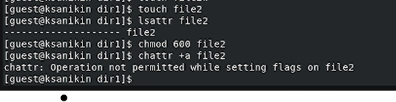
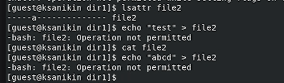
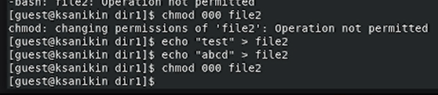
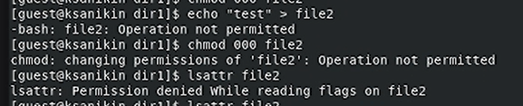

---
## Front matter
lang: ru-RU
title: Лабораторная работа №4
subtitle: Дискреционное разграничение прав в Linux. Расширенные атрибуты
author:
  - Аникин Константин Сергеевич
institute:
  - Российский университет дружбы народов, Москва, Россия
date: 7 сентября 2023

## i18n babel
babel-lang: russian
babel-otherlangs: english

## Formatting pdf
toc: false
toc-title: Содержание
slide_level: 2
aspectratio: 169
section-titles: true
theme: metropolis
header-includes:
 - \metroset{progressbar=frametitle,sectionpage=progressbar,numbering=fraction}
 - '\makeatletter'
 - '\beamer@ignorenonframefalse'
 - '\makeatother'
---

# Информация

## Докладчик

:::::::::::::: {.columns align=center}
::: 

  * Аникин Константин Сергеевич
  * студент
  * просто студент
  * Российский университет дружбы народов
  * [1032201736@rudn.ru](mailto:1032201736@rudn.ru)
  * <https://rituliot.github.io/ru/>

# Вводная часть

## Цель работы

Получение практических навыков работы в консоли с расширенными атрибутами файлов

## Задание

- Создать файл и посмотреть возможные действия с ним для разных разрешений

# Выполнение работы

## Работа с file2

Создал file2, добавил ему права 600 и попытался добавить флаг a (рис. \ref{fig1}).

## Работа с file2

Добавил файлу флаг а и попытался изменить файл, но не вышло. Зато lsattr работает (рис. \ref{fig2}).

## Работа с file2

Убрал флаг а. Теперь могу изменять файл и изменять его права доступа (рис. \ref{fig3}).

## Работа с file2

Под конец добавил флаг i и попытался провернуть те же операции с файлом. Если б я сначала изменил его права, может что-то бы и получилось, но переделывать я не буду (рис. \ref{fig4}).

# Вывод

Работа выполнена полностью