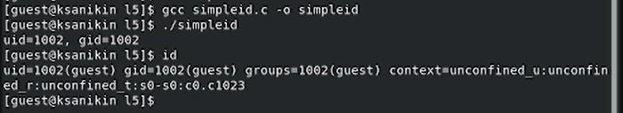

---
## Front matter
title: "Лабораторная работа №5"
subtitle: "Дискреционное разграничение прав в Linux. Исследование влияния дополнительных атрибутов"
author: "Аникин Константин Сергеевич"

## Generic otions
lang: ru-RU
toc-title: "Содержание"

## Bibliography
bibliography: bib/cite.bib
csl: pandoc/csl/gost-r-7-0-5-2008-numeric.csl

## Pdf output format
toc: true # Table of contents
toc-depth: 2
lof: true # List of figures
lot: true # List of tables
fontsize: 12pt
linestretch: 1.5
papersize: a4
documentclass: scrreprt
## I18n polyglossia
polyglossia-lang:
  name: russian
  options:
	- spelling=modern
	- babelshorthands=true
polyglossia-otherlangs:
  name: english
## I18n babel
babel-lang: russian
babel-otherlangs: english
## Fonts
mainfont: PT Serif
romanfont: PT Serif
sansfont: PT Sans
monofont: PT Mono
mainfontoptions: Ligatures=TeX
romanfontoptions: Ligatures=TeX
sansfontoptions: Ligatures=TeX,Scale=MatchLowercase
monofontoptions: Scale=MatchLowercase,Scale=0.9
## Biblatex
biblatex: true
biblio-style: "gost-numeric"
biblatexoptions:
  - parentracker=true
  - backend=biber
  - hyperref=auto
  - language=auto
  - autolang=other*
  - citestyle=gost-numeric
## Pandoc-crossref LaTeX customization
figureTitle: "Рис."
tableTitle: "Таблица"
listingTitle: "Листинг"
lofTitle: "Список иллюстраций"
lotTitle: "Список таблиц"
lolTitle: "Листинги"
## Misc options
indent: true
header-includes:
  - \usepackage{indentfirst}
  - \usepackage{float} # keep figures where there are in the text
  - \floatplacement{figure}{H} # keep figures where there are in the text
---

# Цель работы

Изучение механизмов изменения идентификаторов, применения SetUID- и Sticky-битов. Получение практических навыков работы в консоли с дополнительными атрибутами. Рассмотрение работы механизма смены идентификатора процессов пользователей, а также влияние бита Sticky на запись и удаление файлов

# Задание

- Разобраться с Sticky и SetUID битами

# Теоретическое введение

Есть 3 вида разрешений. Они определяют права пользователя на 3 действия: чтение, запись и выполнение. В Linux эти действия обозначаются вот так:

- r — read (чтение) — право просматривать содержимое файла;

- w — write (запись) — право изменять содержимое файла;

- x — execute (выполнение) — право запускать файл, если это программа или скрипт.

У каждого файла есть 3 группы пользователей, для которых можно устанавливать права доступа. 

- owner (владелец) — отдельный человек, который владеет файлом. Обычно это тот, кто создал файл, но владельцем можно сделать и кого-то другого.

- group (группа) — пользователи с общими заданными правами.

- others (другие) — все остальные пользователи, не относящиеся к группе и не являющиеся владельцами. 

Более подробно о правах доступа см. в [@codecheck:page].

# Выполнение лабораторной работы

Создал программу simpleid (рис. @fig:1).

{#fig:1}

Скомпилировал и запустил её (рис. @fig:2).

{#fig:2} 

Создал программу simpleid2 (рис. @fig:3).

{#fig:3}

Скомпилировал и запустил её (рис. @fig:4).

{#fig:4} 

Создал программу readfile (рис. @fig:5).

{#fig:5}

Скомпилировал и запустил её (рис. @fig:6).

{#fig:6} 

Создал file01.txt, заполнил его через guest, прочитал через guest2 и изменил содержимое (рис. @fig:7).

{#fig:7} 

Изменил Sticky-бит и попытался повторить операции (рис. @fig:8).

{#fig:8} 

# Выводы

Работа выполнена полностью.

# Список литературы{.unnumbered}

::: {#refs}
:::
