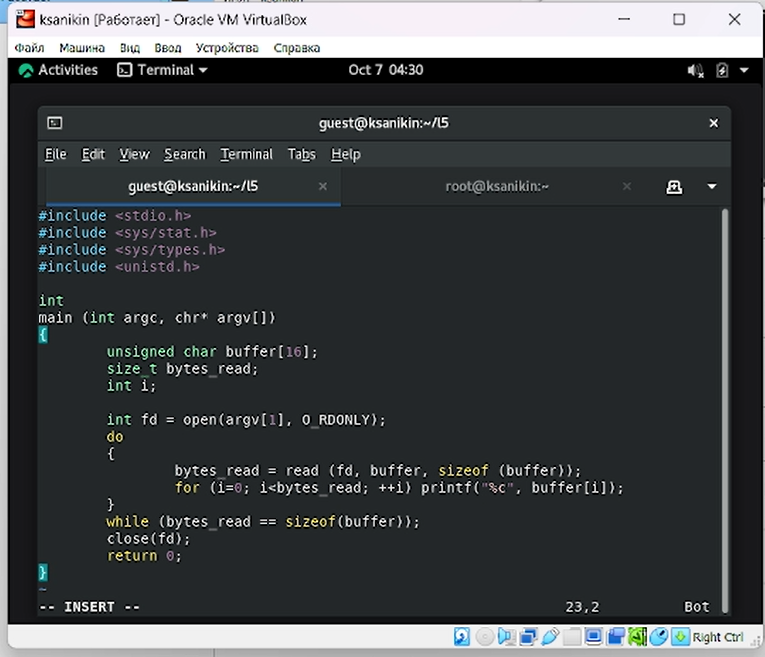
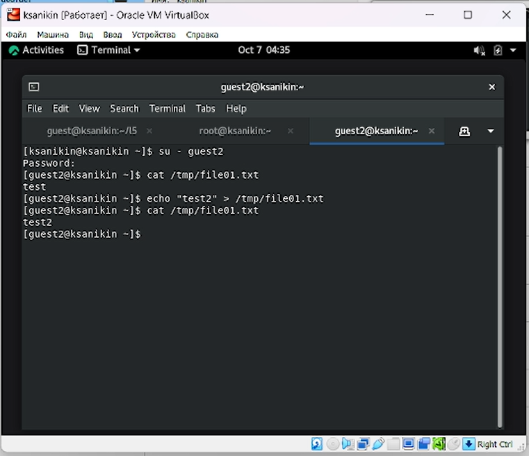

---
## Front matter
lang: ru-RU
title: Лабораторная работа №5
subtitle: Дискреционное разграничение прав в Linux. Исследование влияния дополнительных атрибутов
author:
  - Аникин Константин Сергеевич
institute:
  - Российский университет дружбы народов, Москва, Россия
date: 7 октября 2023

## i18n babel
babel-lang: russian
babel-otherlangs: english

## Formatting pdf
toc: false
toc-title: Содержание
slide_level: 2
aspectratio: 169
section-titles: true
theme: metropolis
header-includes:
 - \metroset{progressbar=frametitle,sectionpage=progressbar,numbering=fraction}
 - '\makeatletter'
 - '\beamer@ignorenonframefalse'
 - '\makeatother'
---

# Информация

## Докладчик

:::::::::::::: {.columns align=center}
::: 

  * Аникин Константин Сергеевич
  * студент
  * просто студент
  * Российский университет дружбы народов
  * [1032201736@rudn.ru](mailto:1032201736@rudn.ru)
  * <https://rituliot.github.io/ru/>

# Вводная часть

## Цель работы

Изучение механизмов изменения идентификаторов, применения SetUID- и Sticky-битов. Получение практических навыков работы в консоли с дополнительными атрибутами. Рассмотрение работы механизма смены идентификатора процессов пользователей, а также влияние бита Sticky на запись и удаление файлов

## Задание

- Разобраться с Sticky и SetUID битами

# Выполнение работы

## Работа с simpleid

Создал программу simpleid (рис. \ref{fig1}).

## Работа с simpleid

Скомпилировал и запустил её (рис. \ref{fig2}).

## Работа с simpleid2

Создал программу simpleid2 (рис. \ref{fig3}).

## Работа с simpleid2

Скомпилировал и запустил её (рис. \ref{fig4}).

## Работа с readfile

Создал программу readfile (рис. \ref{fig5}).

## Работа с readfile

Скомпилировал и запустил её (рис. \ref{fig6}).

## Работа с file01

Создал file01.txt, заполнил его через guest, прочитал через guest2 и изменил содержимое (рис. \ref{fig7}).

## Работа с file01

Изменил Sticky-бит и попытался повторить операции (рис. \ref{fig8}).

# Вывод

Работа выполнена полностью