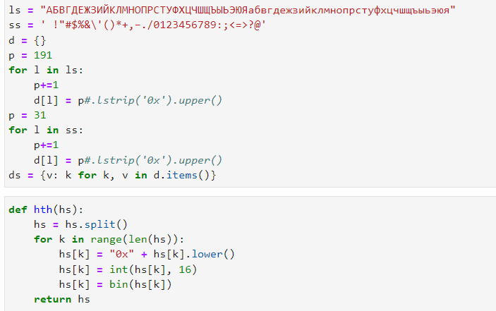
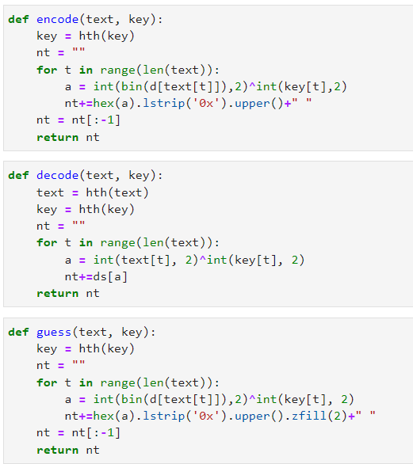
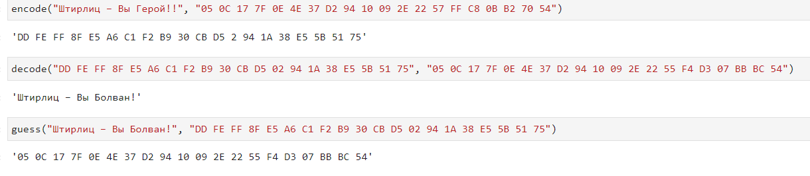

---
## Front matter
lang: ru-RU
title: Лабораторная работа №7
subtitle: Элементы криптографии. Однократное гаммирование
author:
  - Аникин Константин Сергеевич
institute:
  - Российский университет дружбы народов, Москва, Россия
date: 20 октября 2023

## i18n babel
babel-lang: russian
babel-otherlangs: english

## Formatting pdf
toc: false
toc-title: Содержание
slide_level: 2
aspectratio: 169
section-titles: true
theme: metropolis
header-includes:
 - \metroset{progressbar=frametitle,sectionpage=progressbar,numbering=fraction}
 - '\makeatletter'
 - '\beamer@ignorenonframefalse'
 - '\makeatother'
---

# Информация

## Докладчик

:::::::::::::: {.columns align=center}
::: 

  * Аникин Константин Сергеевич
  * студент
  * просто студент
  * Российский университет дружбы народов
  * [1032201736@rudn.ru](mailto:1032201736@rudn.ru)
  * <https://rituliot.github.io/ru/>

# Вводная часть

## Цель работы

Освоить на практике применение режима однократного гаммирования

## Задание

Требуется разработать приложение, позволяющее шифровать и дешифровать данные в режиме однократного гаммирования. Приложение должно:
1. Определить вид шифротекста при известном ключе и известном открытом тексте.
2. Определить ключ, с помощью которого шифротекст может быть преобразован в некоторый фрагмент текста, представляющий собой один из возможных вариантов прочтения открытого текста.

# Выполнение работы

## Вспомогательные функции

## Криптографические функции

## Пример работы функций

# Вывод

Работа выполнена полностью