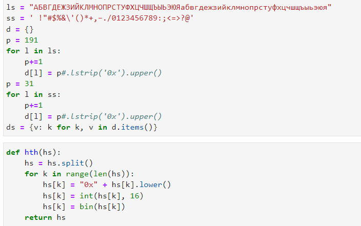
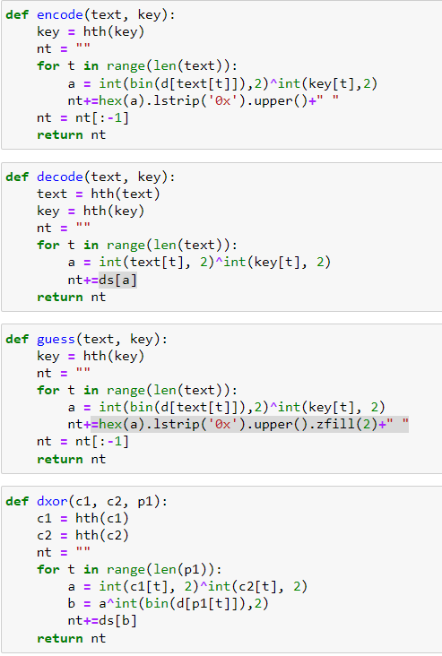
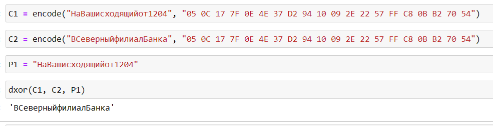

---
## Front matter
lang: ru-RU
title: Лабораторная работа №8
subtitle: Элементы криптографии. Шифрование (кодирование) различных исходных текстов одним ключом
author:
  - Аникин Константин Сергеевич
institute:
  - Российский университет дружбы народов, Москва, Россия
date: 20 октября 2023

## i18n babel
babel-lang: russian
babel-otherlangs: english

## Formatting pdf
toc: false
toc-title: Содержание
slide_level: 2
aspectratio: 169
section-titles: true
theme: metropolis
header-includes:
 - \metroset{progressbar=frametitle,sectionpage=progressbar,numbering=fraction}
 - '\makeatletter'
 - '\beamer@ignorenonframefalse'
 - '\makeatother'
---

# Информация

## Докладчик

:::::::::::::: {.columns align=center}
::: 

  * Аникин Константин Сергеевич
  * студент
  * просто студент
  * Российский университет дружбы народов
  * [1032201736@rudn.ru](mailto:1032201736@rudn.ru)
  * <https://rituliot.github.io/ru/>

# Вводная часть

## Цель работы

Освоить на практике применение режима однократного гаммирования на примере кодирования различных исходных текстов одним ключом

## Задание

Два текста кодируются одним ключом (однократное гаммирование). Требуется не зная ключа и не стремясь его определить, прочитать оба текста. Необходимо разработать приложение, позволяющее шифровать и дешифровать тексты P1 и P2 в режиме однократного гаммирования. Приложение должно определить вид шифротекстов C1 и C2 обоих текстов P1 и P2 при известном ключе; Необходимо определить и выразить аналитически способ, при котором злоумышленник может прочитать оба текста, не зная ключа и не стремясь его определить.

# Выполнение работы

## Вспомогательные функции

## Криптографические функции

## Пример работы функций

# Вывод

Работа выполнена полностью